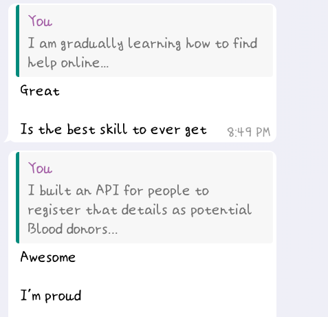

# BLOOD BANK

This repo contains a Django API powered with Django Rest Framework(DRF). It is a simple project of mine (I used it as a side-project for learning DRF :smile:) that serves as a database for potential blood donors to fill in their details so that they can be contacted by hospitals in need of a blood donor.

**I used the following third-party packages**
1. django-rest-auth and django-allauth: for authentication and authorization
2. django-phonenumber-field and phonenumbers: to enable mobile-phone number formatting
3. django-rest-framework: a powerful library (Thanks Tom Christie :happy:)

PS; a comment from my mentor @Williano

#### codeNewbie | backendDEVinView